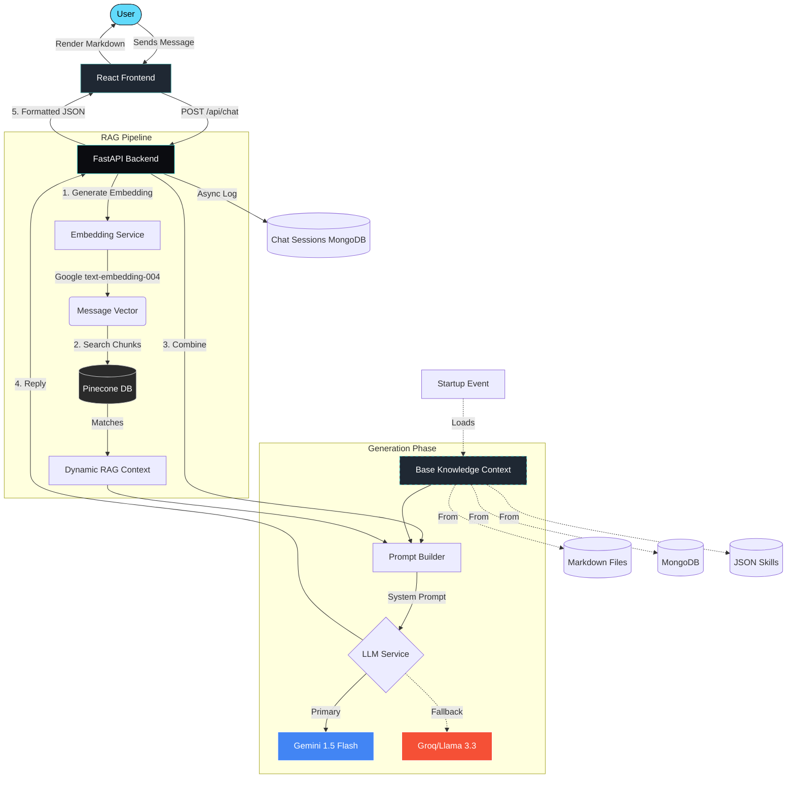

# 🤍 Gwen

Gwen is a personal AI assistant built to answer questions about me, my work, research goals, and projects. Powered by Google Gemini (with Groq fallback), backed by Pinecone vector search, and built with FastAPI + React.

> "Who is Shivam?" — Just ask Gwen.

---

## Quick Start

### 1. Clone

```bash
git clone https://github.com/shivamprasad1001/gwen-ai.git
cd gwen-ai
```

### 2. Backend setup

```bash
cd backend
python -m venv .venv
source .venv/bin/activate      # Windows: .venv\Scripts\activate
pip install -r requirements.txt
```

Create `.env`:
```env
MONGODB_URI=mongodb+srv://...
DB_NAME=personal_ai_db
GEMINI_API_KEY=your_key_here
GROQ_API_KEY=your_key_here
PINECONE_API_KEY=your_key_here
PINECONE_INDEX_NAME=personal-ai
ADMIN_TOKEN=your_secret_token
```

### 3. Seed knowledge base

```bash
python ingest_pinecone.py
```

This reads all files in `data/`, chunks them, embeds with Gemini, and upserts to Pinecone. Run once. Re-run when you update your data.

### 4. Start backend

```bash
uvicorn main:app --reload
# running at http://localhost:8000
```

### 5. Frontend setup

```bash
cd ../frontend
npm install
npm run dev
# running at http://localhost:5173
```

---

## MongoDB Atlas Setup

1.  Create free M0 cluster at [cloud.mongodb.com](https://cloud.mongodb.com)
2.  Get connection string → paste into `MONGODB_URI` in `.env`
3.  Whitelist your IP in Network Access
4.  Collections are auto-created on first run:
    - `chat_sessions` — conversation history
    - `knowledge_base` — optional manual entries

---

## Pinecone Setup

1.  Sign up at [pinecone.io](https://pinecone.io)
2.  Create index:
    - Name: `personal-ai`
    - Dimensions: `768`
    - Metric: `cosine`
    - Cloud: `AWS`, Region: `us-east-1`
3.  Copy API key → paste into `PINECONE_API_KEY` in `.env`
4.  Run `python ingest_pinecone.py`

---

## Updating Knowledge Base

Edit any file in `backend/data/` then re-run:

```bash
python ingest_pinecone.py
```

Or hot-reload without restart:
```bash
curl -X POST http://localhost:8000/api/admin/reload-knowledge \
  -H "x-admin-token: your_secret_token"
```

---

## API Endpoints

| Method | Endpoint | Description |
| :--- | :--- | :--- |
| POST | `/api/chat` | Send message, get reply |
| POST | `/api/suggestions` | Get follow-up suggestions |
| POST | `/api/admin/reload-knowledge` | Hot-reload knowledge (protected) |
| GET | `/api/health` | Health check |

---

## Environment Variables

| Variable | Description |
| :--- | :--- |
| `MONGODB_URI` | MongoDB Atlas connection string |
| `DB_NAME` | Database name (default: personal_ai_db) |
| `GEMINI_API_KEY` | Google AI Studio API key |
| `GROQ_API_KEY` | Groq Cloud API key |
| `PINECONE_API_KEY` | Pinecone API key |
| `PINECONE_INDEX_NAME` | Pinecone index name |
| `ADMIN_TOKEN` | Secret token for admin endpoints |

---

## System Architecture: Pinecone RAG Workflow

This diagram illustrates the end-to-end flow of a user message through the Gwen AI system.



### Flow Breakdown:

1.  **Initialize**: At server startup, the bot loads "Base Knowledge" (bio, projects, skills) from local files and MongoDB.
2.  **Embed**: Your question is turned into a numeric vector using Google Gemini embeddings.
3.  **Retrieve**: The system searches **Pinecone** for the technical chunks (resume, deep project history) that most closely match your question.
4.  **Synthesize**: It builds a comprehensive prompt combining who you are (Base Knowledge) and the specific facts it just found (RAG Context).
5.  **Generate**: The LLM reads this "Cheat Sheet" and answers in your voice, perfectly informed.
6.  **Log**: The conversation is stored in MongoDB for session memory.

---

## License

MIT — feel free to fork and build your own personal AI.

---

<div align="center">
  <p>Built by <a href="https://shivamprasad1001.in">Shivam Prasad</a></p>
  <p>
    <a href="https://trivilabs.in">TriviLabs</a> ·
    <a href="https://shivamprasad1001.in">Portfolio</a>
  </p>
  <sub>Powered by Gemini · Groq · Pinecone · FastAPI · React</sub>
</div>
